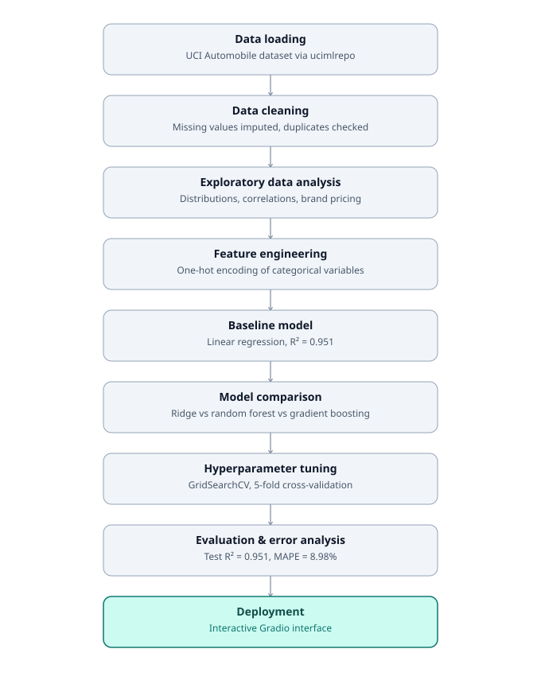
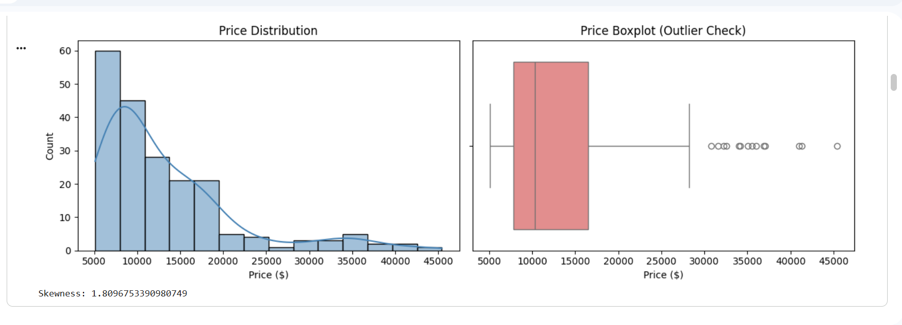
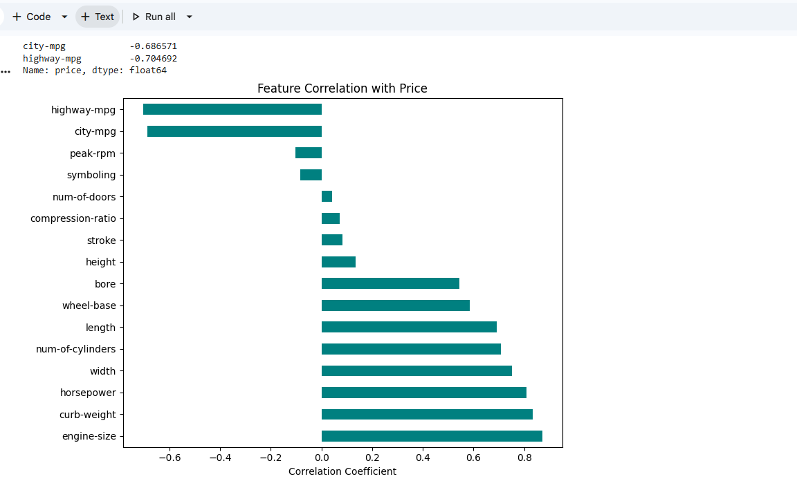
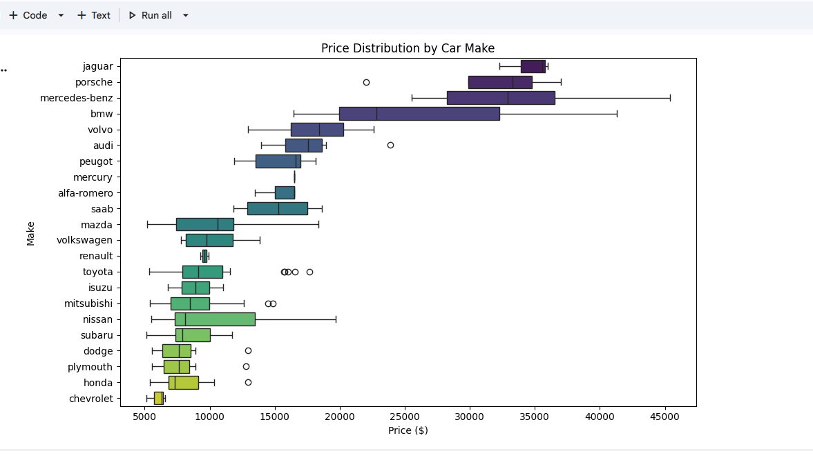
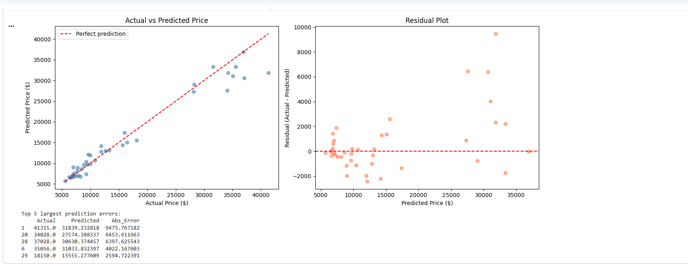
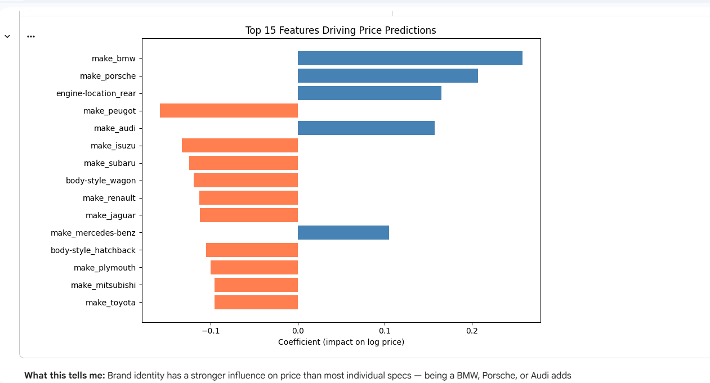
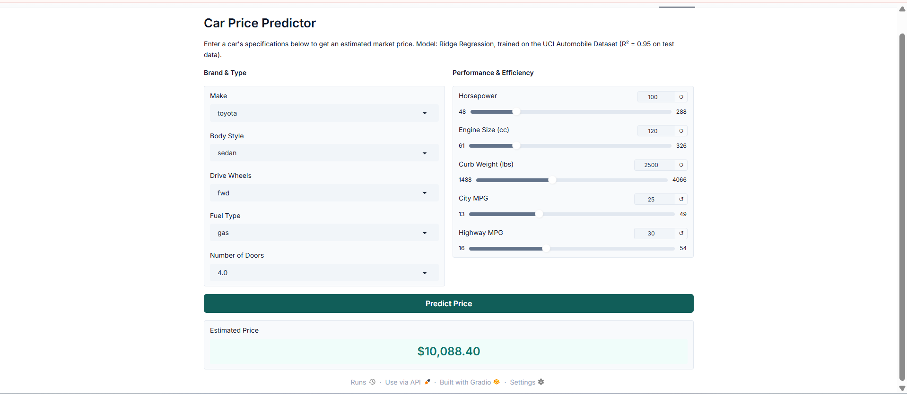
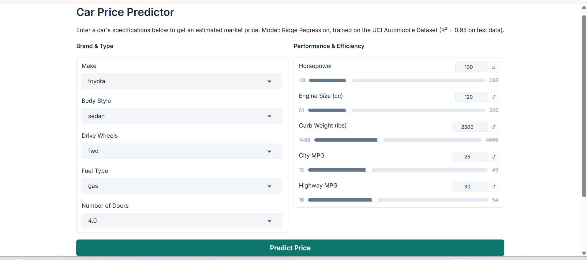
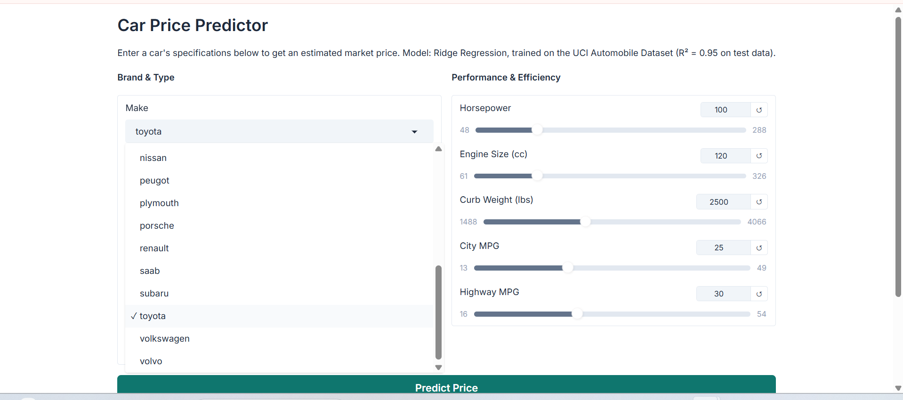
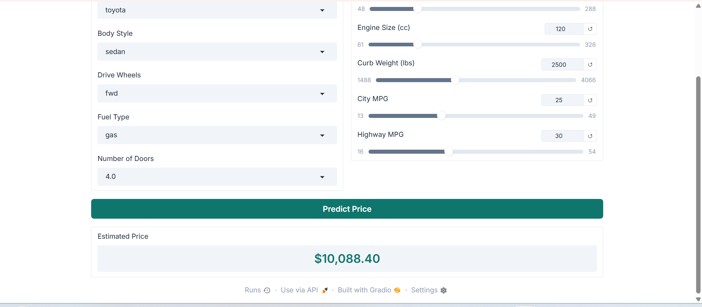

# Car Price Prediction — Regression Analysis


**[Try the live app on Hugging Face Spaces →](https://huggingface.co/spaces/ailanasirai/car-price-predictor)**

Predicting used-car market prices from technical specifications using a Ridge Regression model, with a full workflow covering data cleaning, EDA, feature engineering, model comparison, hyperparameter tuning, error analysis, and explainability — deployed live as an interactive web app on Hugging Face Spaces.

---

## Key Results

| Metric | Score |
|---|---|
| R² (Test Set) | **0.951** |
| MAE | **$1,503.30** |
| RMSE | **$2,449.37** |
| MAPE | **8.98%** |

The final model explains ~95% of the variance in car prices, with predictions averaging within 9% of the actual market price.

---

## Workflow



---

## Problem Statement

Pricing a used car is a decision that combines dozens of interacting technical specifications — engine size, weight, brand reputation, fuel efficiency, and more. Manual pricing is inconsistent and hard to justify. This project builds a regression model that predicts a car's price from its specifications, and — just as importantly — explains *why* it arrives at that number, rather than acting as a black box.

## Why This Problem Matters

Accurate, explainable price estimation is directly useful for dealerships, resale marketplaces, and individual buyers/sellers trying to sanity-check a quoted price. Beyond the business use case, this dataset is a good testbed for demonstrating a disciplined regression workflow: handling missing data honestly, choosing a model based on evidence rather than hype, and being transparent about where the model still struggles.

---

## Dataset

**Source:** [UCI Machine Learning Repository — Automobile Dataset](https://archive.ics.uci.edu/dataset/10/automobile)

- 205 rows, 26 columns (before cleaning) covering make, body style, engine specs, dimensions, fuel economy, and price
- Loaded directly via the `ucimlrepo` Python package for full reproducibility — no manual downloads
- Missing values were originally encoded as `"?"` rather than `NaN`

---

## Methodology

### 1. Data Cleaning
- Replaced `"?"` placeholders with proper `NaN` values
- Dropped 4 rows with missing `price` (the target cannot be safely imputed)
- Dropped `normalized-losses` entirely (~20% missing — too much to impute reliably)
- Imputed `stroke`, `bore`, `peak-rpm`, `horsepower`, and `num-of-doors` using the median (robust to outliers) since each had only 2–4 missing values
- Confirmed zero duplicate rows

### 2. Exploratory Data Analysis



- `price` is strongly right-skewed (skewness ≈ 1.81) — addressed via log transformation during modeling
- `engine-size`, `curb-weight`, and `horsepower` show the strongest positive correlation with price (0.87, 0.83, 0.81)
- `city-mpg` and `highway-mpg` show strong negative correlation (~-0.70) — fuel-efficient cars tend to be smaller, cheaper models



- Brand carries pricing signal independent of specs: luxury brands (BMW, Porsche, Mercedes-Benz) cluster above $25,000, while economy brands (Chevrolet, Honda, Plymouth) sit under $10,000



### 3. Feature Engineering
- One-hot encoded all categorical variables (`make`, `body-style`, `drive-wheels`, `fuel-type`, etc.) since none have a natural order
- Dropped `symboling` (an insurance risk rating unrelated to price, confirmed by near-zero correlation)
- Final feature set: 57 columns after encoding

### 4. Baseline
A plain Linear Regression was trained first as a reference point. It already achieved R² = 0.951 on the test set, indicating the underlying relationship between specs and price is largely linear.

### 5. Model Comparison
Four models were compared using 5-fold cross-validation on the training set:

| Model | Mean CV R² | Std Dev |
|---|---|---|
| Linear Regression | 0.8319 | ±0.0512 |
| **Ridge Regression** | **0.8946** | **±0.0146** |
| Random Forest | 0.8787 | ±0.0206 |
| Gradient Boosting | 0.8829 | ±0.0203 |

Ridge Regression was selected as the final model — not because ensemble methods are inherently worse, but because with only 201 rows, tree-based models tend to overfit small tabular datasets while a regularized linear model generalizes more reliably. Ridge also had the lowest variance across folds, making it the most consistent choice.

### 6. Hyperparameter Tuning
`GridSearchCV` was used to tune Ridge's `alpha` parameter across `[0.01, 0.1, 1.0, 5.0, 10.0, 20.0, 50.0, 100.0]`. The default value, `alpha = 1.0`, was confirmed optimal — indicating the model wasn't suffering from over- or under-regularization that heavier tuning needed to fix.

### 7. Validation Strategy
An 80/20 train-test split (`random_state=42`) was used, with 5-fold cross-validation during model selection and tuning to avoid relying on a single lucky/unlucky split. The test set was never touched until final evaluation.

---

## Error Analysis



Errors are **not random** — they concentrate systematically in the high-price segment. The five largest prediction errors were all for cars priced above $34,000, and the model consistently *underpredicts* these. This traces back to the EDA: luxury brands make up a small fraction of the 201 available rows, so the model has fewer examples to learn from in that price tier. This is a genuine limitation of dataset size rather than a flaw in the modeling approach — a larger, more balanced dataset across price tiers would likely close this gap.

## Explainability



Since Ridge is a linear model, its coefficients are directly interpretable. The strongest positive drivers of predicted price are `make_bmw`, `make_porsche`, `engine-location_rear`, `make_audi`, and `make_mercedes-benz` — confirming that brand identity adds a real premium beyond raw specifications. The strongest negative drivers are budget-oriented brands like `make_peugot`, `make_isuzu`, and `make_subaru`.

---

## Live Demo

**Live app:** [huggingface.co/spaces/ailanasirai/car-price-predictor](https://huggingface.co/spaces/ailanasirai/car-price-predictor)

An interactive Gradio interface lets users enter a car's specifications and get an instant price estimate, using the same preprocessing pipeline as training to keep predictions consistent with the model's actual behavior. Deployed on Hugging Face Spaces.









---

## Repository Structure

```
EXPS_CarPricePrediction/
├── README.md
├── LICENSE
├── requirements.txt
├── notebooks/
│   └── EXPS_CarPricePrediction.ipynb
├── models/
│   ├── car_price_model.pkl
│   └── model_columns.pkl
├── pipeline_flow.svg
├── price_distribution.png
├── correlation_barplot.png
├── price_by_brand.png
├── actual_vs_predicted.png
├── feature_importance.png
├── huggingface_live_deployment.png
├── gradio_interface.png
├── gradio_interface_inputs.png
├── gradio_interface_result.png
└── app.py                  # Gradio deployment script (live on Hugging Face Spaces)
```

---

## How to Reproduce

```bash
git clone https://github.com/ailanasirai/EXPS_CarPricePrediction.git
cd EXPS_CarPricePrediction
pip install -r requirements.txt
jupyter notebook notebooks/EXPS_CarPricePrediction.ipynb
```

To run the live app locally:

```bash
python app.py
```

Or try it instantly without any setup: **[huggingface.co/spaces/ailanasirai/car-price-predictor](https://huggingface.co/spaces/ailanasirai/car-price-predictor)**

---

## Technologies Used

- **Python** — pandas, numpy
- **scikit-learn** — Ridge Regression, GridSearchCV, cross-validation, metrics
- **ucimlrepo** — reproducible dataset access
- **matplotlib, seaborn** — visualization
- **Gradio** — interactive deployment
- **Hugging Face Spaces** — live hosting
- **joblib** — model persistence

---

## Limitations

- Dataset is small (201 rows after cleaning), which limits performance on underrepresented price segments (luxury vehicles)
- The dataset reflects vehicle specifications and pricing conventions from its original collection period, not current-day market prices
- One-hot encoding of `make` means the model cannot generalize to brands outside the training data

## Future Improvements

- Incorporate a larger, more recent dataset with better representation across price tiers
- Explore target/frequency encoding for `make` as an alternative to one-hot encoding
- Add SHAP-based explanations for individual predictions in the deployed app

---

## Acknowledgments

Developed as part of the EXPS Nexus Data Science Internship (Expert Petroleum Services).

## Author

**Aila Nasir**
[LinkedIn](https://linkedin.com/in/ailanasirai) · [GitHub](https://github.com/ailanasirai) · [Live App](https://huggingface.co/spaces/ailanasirai/car-price-predictor)

---

*I certify that this project was independently developed, tested, and documented by me — full code and commit history available on [GitHub](https://github.com/ailanasirai/EXPS_CarPricePrediction), portfolio and background on [LinkedIn](https://linkedin.com/in/ailanasirai).*
